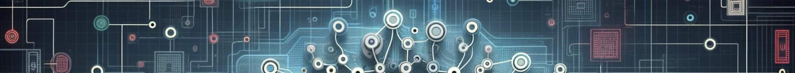

# Welcome to the Physics-based Deep Learning book (PBDL) v0.2

This is the source code repository for the Jupyter book "Physics-based Deep Learning". You can find the full, readable version online at:
[https://physicsbaseddeeplearning.org/](https://physicsbaseddeeplearning.org/)

A single-PDF version is also available on arXiv: https://arxiv.org/pdf/2109.05237.pdf 

# A Short Synopsis

The PBDL book contains a hands-on, comprehensive guide to deep learning in the realm of physical simulations. Rather than just theory, we emphasize practical application: every concept is paired with interactive Jupyter notebooks to get you up and running quickly. Beyond traditional supervised learning, we dive into physical loss-constraints, differentiable simulations, diffusion-based approaches for probabilistic generative AI, as well as reinforcement learning and advanced neural network architectures. These foundations are paving the way for the next generation of scientific foundation models. We are living in an era of rapid transformation. These methods have the potential to redefine what’s possible in computational science.

The key aspects that we will address in the following are:

* How to train neural networks to predict the fluid flow around airfoils with diffusion modeling. This gives a probabilistic surrogate model that replaces and outperforms traditional simulators.
* How to use model equations as residuals to train networks that represent solutions, and how to improve upon these residual constraints by using differentiable simulations.
* How to more tightly interact with a full simulator for inverse problems. E.g., we’ll demonstrate how to circumvent the convergence problems of standard reinforcement learning techniques by leveraging simulators in the training loop.
* We’ll also discuss the importance of choosing the right network architecture: whether to consider global or local interactions, continuous or discrete representations, and structured versus unstructured graph meshes.

The focus of this book lies on:

* how to use deep learning techniques to solve PDE problems,
* how to combine them with existing knowledge of physics,
* without discarding numerical methods.

At the same time, it’s worth noting what we won’t be covering:

* There’s no in-depth introduction to deep learning and numerical simulations,
* and the aim is neither a broad survey of research articles in this area.

The name of this book, _Physics-based Deep Learning_, denotes combinations of physical modeling and numerical simulations with methods based on artificial neural networks. The general direction of Physics-Based Deep Learning represents a very active, quickly growing and exciting field of research.

The aim is to build on all the powerful numerical techniques that we have at our disposal, and use them wherever we can. As such, a central goal of this book is to reconcile the data-centered viewpoint with physical simulations.

The resulting methods have a huge potential to improve what can be done with numerical methods: in scenarios where a solver targets cases from a certain well-defined problem domain repeatedly, it can for instance make a lot of sense to once invest significant resources to train a neural network that supports the repeated solves. Based on the domain-specific specialization of this network, such a hybrid could vastly outperform traditional, generic solvers.

# What's new?

What’s new in v0.3? This latest edition takes things even further with a major new chapter on generative modeling, covering cutting-edge techniques like denoising, flow-matching, autoregressive learning, physics-integrated constraints, and diffusion-based graph networks. We’ve also introduced a dedicated section on neural architectures specifically designed for physics simulations. All code examples have been updated to leverage the latest frameworks.

# Teasers

To mention a few highlights: the book contains a notebook to train hybrid fluid flow (Navier-Stokes) solvers via differentiable physics to reduce numerical errors. Try it out in Colab:
https://colab.research.google.com/github/tum-pbs/pbdl-book/blob/main/diffphys-code-sol.ipynb

PBDL also has example code to train diffusion denoising and flow matching networks for RANS flow predictions around airfoils that yield uncertainty estimates. You can run the code right away here:
https://colab.research.google.com/github/tum-pbs/pbdl-book/blob/main/probmodels-ddpm-fm.ipynb

There's a notebook for an improved learning scheme which jointly computes update directions for neural networks and physics (via half-inverse gradients):
https://colab.research.google.com/github/tum-pbs/pbdl-book/blob/main/physgrad-hig-code.ipynb

And a notebook to compare proximal policy-based reinforcement learning with physics-based learning for controlling PDEs (spoiler: the physics-aware version does better in the end). Give it a try:
https://colab.research.google.com/github/tum-pbs/pbdl-book/blob/main/reinflearn-code.ipynb

