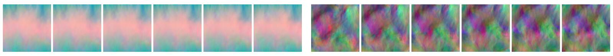

Introduction to Posterior Inference
=======================

We should keep in mind that for all measurements, models, and discretizations we have uncertainties. For measurements and observations, this typically appears in the form of measurement errors. Model equations equations, on the other hand, usually encompass only parts of a system we're interested in (leaving the remainder as an uncertainty), while for numerical simulations we inherently introduce discretization errors. So a very important question to ask here is how we can be sure that an answer we obtain is the correct one. From a statisticians viewpoint, we'd like to know the posterior probability distribution, a distribution that captures possible uncertainties we have about our model or data.

## Uncertainty 

This admittedly becomes even more difficult in the context of machine learning:
we're typically facing the task of approximating complex and unknown functions.
From a probabilistic perspective, the standard process of training an NN here
yields a _maximum likelihood estimation_ (MLE) for the parameters of the network.
However, this MLE viewpoint does not take any of the uncertainties mentioned above into account:
for DL training, we likewise have a numerical optimization, and hence an inherent
approximation error and uncertainty regarding the learned representation.
Ideally, we should reformulate the learning process such that it takes 
its own uncertainties into account, and it should make
_posterior inference_ possible,
i.e. learn to produce the full output distribution. However, this turns out to be an
extremely difficult task.

This is where so-called _Bayesian neural network_ (BNN) approaches come into play. They 
allow for a form of posterior inference by making assumptions about the probability 
distributions of individual parameters of the network. This gives a distribution for the
parameters, with which we can evaluate the network multiple times to obtain different versions
of the output, and in this way sample the distribution of the output.

Nonetheless, the task
remains very challenging. Training a BNN is typically significantly more difficult
than training a regular NN. This should come as no surprise, as we're trying to 
learn something fundamentally different here: a full probability distribution 
instead of a point estimate. (All previous chapters "just" dealt with
learning such point estimates, and the tasks were still far from trivial.)

```{admonition} Aleatoric and Epistemic Uncertainty
:class: tip
Although we won't go into detail within the scope of this book, many works 
distinguish two types of uncertainty which are important to mention here:

- _Aleatoric_ uncertainty denotes uncertainty within the data, e.g., noise in measurements.

- _Epistemic_ uncertainty, on the other hand, describes uncertainties within a model such as a trained neural network.

In the following we'll primarily target _epistemic_ uncertainty via posterior inference. 
However, as a word of caution: if they appear together, the different kinds of uncertainties (the two types above are not exhaustive) are very difficult to disentangle in practice. 
```



## Introduction to Bayesian Neural Networks

In order to combine posterior inference with Neural Networks, we can use standard techniques from Bayesian Modeling and combine them with the Deep Learning machinery. In Bayesian Modeling, we aim at learning _distributions_ over the model parameters instead of these fixed point estimates. In the case of NNs, the model parameters are the weights and biases, summarized by $\theta$, for a neural network $f$. Our goal is therefore to learn a so-called _posterior distribution_ $p({\theta}|{D})$ from the data $D$, which captures the uncertainty we have about the networks weights and biases _after_ observing the data $D$. This posterior distribution is the central quantity of interest here: if we can estimate it reasonably well, we can use it to make good predictions, but also assess uncertainties related to those predictions. For both objectives it is necessary to _marginalize_ over the posterior distribution, i.e. integrate it out. A single prediction for input $x_{i}$ can for example be obtained via

$$
    \hat{y_{i}}=\int f(x_{i}; \theta) ~ p(\theta|D) ~ d\theta
$$

Similarly, one can for instance compute the standard deviation in order to assess a measure of uncertainty over the prediction $\hat{y_{i}}$.

## Prior distributions

In order to obtain the required posterior distribution, in Bayesian modeling one first has to define a _prior distribution_ $p({\theta})$ over the network parameters. This prior distribution should encompass the knowledge we have about the network weights _before_ training the model. We for instance know that the weights of neural networks are usually rather small and can be both positive and negative. Centered normal distributions with some small variance parameter are therefore a standard choice. For computational simplicity, they are typically also assumed to be independent from another. When observing data ${D}$, the prior distribution over the weights is updated to the  posterior according to Bayes rule:

$$
    p({\theta}|{D}) = \frac{p({D}|{\theta})p({\theta})}{p({D})}
    \text{ . }
$$

This is, we update our a-priori knowledge after observing data, i.e. we _learn_ from data. The computation required for the Bayesian update is usually intractable, especially when dealing with non-trivial network architectures. Therefore, the posterior $p({\theta}|{D})$ is approximated with an easy-to-evaluate variational distribution $q_{\phi}(\theta)$, parametrized by $\phi$. Again, independent Normal distributions are typically used for each weight. Hence, the parameters $\phi$ contain all mean and variance parameters $\mu, \sigma$ of those normal distributions. 
The optimization goal is then to find a distribution $q_{\phi}(\theta)$ that is close to the true posterior.
One way of assessing this closeness is the KL-divergence, a method used widely in practice for measuring the similarity of two distributions.

## Evidence lower bound

We cannot directly minimize the KL-divergence between approximate and true posterior $KL(q_{\phi}({\theta})||p({\theta|D})$, because we do not have access to the true posterior distribution. It is however possible to show that one can equivalently maximize the so-called evidence lower bound (ELBO), a quantity well known from variational inference: 

$$
    \mathcal{L}(\phi)=  E_{q_{\phi}}[\log(p(D|{\theta}))] - KL(q_{\phi}({\theta})||p({\theta})) 
    \text{ , }
$$ 

The ELBO (or negative ELBO, if one prefers to minimize instead of maximize) is the optimization objective for BNNs. The first term is an expected log-likelihood of the data. Maximizing it means explaining the data as well as possible. In practice, the log-likelihood is often a conventional loss functions like mean squared error (note that MSE can be seen as negative log-likelihood for normal noise with unit variance). The second term is the negative KL-divergence between the approximate posterior and the prior. For suitable prior and approximate posterior choices (like the ones above), this term can be computed analytically. Maximizing it means encouraging the approximate network weight distributions to stay close to the prior distribution. In that sense, the two terms of the ELBO  have opposite goals: The first term encourages the model to explain the data as well as possible, whereas the second term encourages the model to stay close to the (random) prior distributions, which implies randomness and regularization.

The expectation of the log-likelihood is typically not available in analytical form, but can be approximated in several ways. One can, for instance, use Monte-Carlo sampling and draw $S$ samples from $q_{\phi}({\theta})$. The expectation is then approximated via $\frac{1}{S}\sum_{s=1}^{S}\log(p(D|{\theta_{s}})$. In practice, even a single sample, i.e. $S=1$ can be enough. Furthermore, the expectation of the log-likelihood is typically not evaluated on the whole data set, but approximated by a batch of data $D_{batch}$, which enables the use of batch-wise stochastic gradient descent. 

## The BNN training loop

For $S=1$, one iteration of the training loop then boils down to
1. sampling a batch of data $D_{batch}$
2. sampling network weights and biases from $q_{\phi}({\theta})$
3. forwarding the batch of data through the network according to the sampled weights
4. evaluating the ELBO
5. backpropagating the ELBO through the network and updating $\phi$

If $S>1$, steps 2 and 3 have to be repeated $S$ times in order to compute the ELBO. In that sense, training a variational BNN is fairly similar to training a conventional NN: We still use SGD and forward-backward passes to optimize our loss function. Only that now we are optimizing over distributions instead of single values. If you are curious on how one can backpropagate through distributions, you can, e.g., read about it [here](https://arxiv.org/abs/1505.05424), and a more detailed introduction to Bayesian Neural Networks is available in Y. Gals [thesis](https://mlg.eng.cam.ac.uk/yarin/thesis/thesis.pdf), in chapters 2 & 3.

## Dropout as alternative

% todo, cite [Gal et al](https://arxiv.org/abs/1506.02142) 
Previous work has shown that using dropout is mathematically equivalent to an approximation to the probabilistic deep Gaussian process. Furthermore, for a specific prior (satisfying the so-called KL-condition) and specific approximate posterior choice (a product of Bernoulli distributions), training a neural network with dropout and L2 regularization and training a variational BNN results in an equivalent optimization procedure. In other words, dropout neural networks are a form of Bayesian neural networks.

Obtaining uncertainty estimates is then as easy as training a conventional neural network with dropout and extending dropout, which traditionally has only been used during the training phase, to the prediction phase. This will lead to the predictions being random (because dropout will randomly drop some of the activations), which allows us to compute average and standard deviation statistics for single samples from the data set, just like for the variational BNN case.
It is an ongoing discussion in the field whether variational or dropout-based methods are preferable. 

## A practical example

As a first real example for posterior inference with variational BNNs, let's revisit the
case of turbulent flows around airfoils, from {doc}`supervised-airfoils`. 
However, in contrast to the point estimate learned in this section, we'll now aim for
learning the full posterior.

