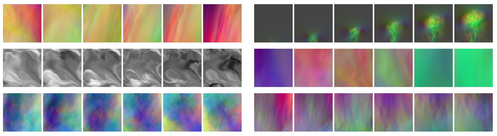

Welcome ... 
============================

Welcome to the _Physics-based Deep Learning Book_ 👋

**TL;DR**: 
This document targets a variety of combinations of physical simulations with deep learning.
As much as possible, the algorithms will come with hands-on code examples to quickly get started.
Beyond standard _supervised_ learning from data, we'll look at _physical loss_ constraints, and 
more tightly coupled learning algorithms with _differentiable simulations_.


```{figure} resources/teaser.jpg
---
height: 220px
name: pbdl-teaser
---
Some visual examples of numerically simulated time sequences. In this book, we aim for algorithms that use neural networks alongside numerical solvers.
```
% Teaser, simple version:
% 

## Coming up

As a _sneak preview_, in the next chapters will show:

- How to train networks to infer fluid flows around shapes like airfoils in one go, i.e., a _surrogate model_ that replaces a traditional numerical simulation.

- How to use model equations as residuals to train networks that represent solutions, and how to improve upon these residual constraints by using _differentiable simulations_.

- How to more tightly interact with a full simulator for _inverse problems_. E.g., we'll demonstrate how to circumvent the convergence problems of standard reinforcement learning techniques by leveraging simulators in the training loop.

This _book_, where "book" stands for a collection of texts, equations, images and code examples,
is maintained by the
[TUM Physics-based Simulation Group](https://ge.in.tum.de). Feel free to contact us via
[old fashioned email](mailto:i15ge@cs.tum.edu) if you have any comments. 
If you find mistakes, please also let us know! We're aware that this document is far from perfect,
and we're eager to improve it. Thanks in advance!

This collection of materials is a living document, and will grow and change over time. 
Feel free to contribute 😀 
We also maintain a [link collection](https://github.com/thunil/Physics-Based-Deep-Learning) with recent research papers.

```{admonition} Executable code, right here, right now
:class: tip
We focus on jupyter notebooks, a key advantage of which is that all code examples
can be executed _on the spot_, with your browser. You can modify things and 
immediately see what happens -- give it a try...
<br><br>
Oh, and it's great because it's [literate programming](https://en.wikipedia.org/wiki/Literate_programming).
```


---


## Thanks!

This project would not have been possible without the help of many people who contributed. Thanks to everyone 🙏 Here's an alphabetical list:

- [Philipp Holl](https://ge.in.tum.de/about/)
- [Georg Kohl](https://ge.in.tum.de/about/georg-kohl/)
- [Maximilian Mueller](https://ge.in.tum.de/about/)
- [Patrick Schnell](https://ge.in.tum.de/about/patrick-schnell/)
- [Nils Thuerey](https://ge.in.tum.de/about/n-thuerey/)
- [Kiwon Um](https://ge.in.tum.de/about/kiwon/)


