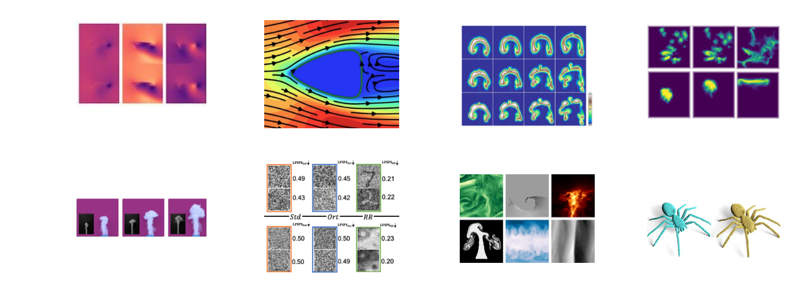

Welcome ... 
============================

Welcome to the Physics-based Deep Learning Book 👋

**TL;DR**: This document targets 
a veriety of combinations of physical simulations with deep learning.
As much as possible, the algorithms will come with hands-on code examples to quickly get started.
Beyond standard _supervised_ learning from data, we'll look at loss constraints, and 
more tightly coupled learning algorithms with differentiable simulations.

```{figure} resources/teaser.png
---
height: 220px
name: pbdl-teaser
---
Some examples ... preview teaser ...
```
% Teaser, simple version:
% 


As a _sneak preview_, in the next chapters we'll show:

- How to train networks to infer fluid flow solutions around shapes like airfoils in one go, i.e., without needing a simulator.

- We'll show how to use model equations as residual to train networks that represent solutions, and how to improve upon this behavior by using differentiable simulations.

- Even more tightly coupling a full _rough_ simulator for control problems is another topic. E.g., we'll demonstrate how to circumvent the convergence problems of standard reinforcement learning techniques by leveraging simulators in the training loop.

This _book_, where book stands for a collection of text, equations, images and code examples,
is maintained by the
[TUM Physics-based Simulation Group](https://ge.in.tum.de). Feel free to contact us via
[old fashioned email](mailto:i15ge@cs.tum.edu) if you have any comments. 
If you find mistakes, please also let us know! We're aware that this document is far from perfect,
and we're eager to improve it. Thanks in advance!

This collection of materials is a living document, and will grow and change over time. 
Feel free to contribute 😀

[TUM Physics-based Simulation Group](https://ge.in.tum.de).

We also maintain a [link collection](https://github.com/thunil/Physics-Based-Deep-Learning) with recent research papers.

```{admonition} Code, executable, right here, right now
:class: tip
We focus on jupyter notebooks, a key advantage of which is that all code examples
can be executed _on the spot_, out of a browser. You can modify things and 
immediately see what happens -- give it a try...
<br><br>
Oh, and it's great because it's [literate programming](https://en.wikipedia.org/wiki/Literate_programming).
```

## Specifically

To be a bit more specific, _physics_ is a huge field, we can't cover everything... 

```{note}
For now our focus is:
- field-based simulations , less Lagrangian
- simulations, not experiments
- combination with _deep learning_ (plenty of other interesting ML techniques)
```

---


## Thanks!

The contents of the following files would not have been possible without the help of many people. Here's an alphabetical list. Big kudos to everyone 🙏

- Mr. X
- Ms. y
- ...


% some markdown tests follow ...

---

a b c

```{admonition} My title2
:class: seealso
See also... Test link: {doc}`supervised`
```

✅  Do this , ❌  Don't do this

% ----------------

---


## Planned content

Loose collection of notes and TODOs:

General physics & dl , intro & textual overview

- 	Intro phys loss example, notebook patrick

Supervised? Airfoils? Liwei, simple example? app: optimization, shape opt w surrogates

-    AIAA supervised learning , idp_weissenov/201019-upd-arxiv-v2/  {cite}`thuerey2020deepFlowPred`
    skepticism? , started colab -> https://colab.research.google.com/drive/11KUe5Ybuprd7_qmNTe1nvQVUz3W6gRUo
    torch version 1.7 [upd from Liwei?]

vs. PINNs [alt.: neural ODEs , PDE net?] , all using GD (optional, PINNs could use BFGS)
    [PINNs], phiflow example -> convert to colab

-    PINNs -> are unsupervised a la tompson; all DL NNs are "supervised" during learning, unsup just means not precomputed and goes through function

-    add image | NN | <> | Loss | , backprop; (bring back every section, add variants for other methods?)

-    discuss CG solver, tompson as basic ''unsupervisedd'' example?

Diff phys, start with overview of idea: gradients via autodiff, then run GD
        (TODO include squared func Patrick?)

-    illustrate and discuss gradients -> mult. for chain rule; (later: more general PG chain w func composition)

-    Differentiable Physics (w/o network) , {cite}`holl2019pdecontrol` 
        -> phiflow colab notebook good start, but needs updates (see above Jan2)

-    SOL_201019-finals_Solver-in-the-Loop-Main-final.pdf , {cite}`um2020sol` 
        numerical errors, how to include in jupyter / colab?

-    ICLR_190925-ICLR-final_1d8cf33bb3c8825e798f087d6cd35f2c7c062fd4.pdf alias
        PDE control, control focused
        https://github.com/holl-/PDE-Control    -> update to new version?

beyond GD: re-cap newton & co

Phys grad (PGs) as fundamental improvement, PNAS case; add more complex one?
        PG update of poisson eq? see PNAS-template-main.tex.bak01-poissonUpdate , explicitly lists GD and PG updates

- PGa 2020 Sept, content: ML & opt
    Gradients.pdf, -> overleaf-physgrad/ 

- PGb 201002-beforeVac, content: v1,v2,old - more PG focused
    -> general intro versions

TODO, for version 2.x add: 

time series, sequence prediction?] {cite}`wiewel2019lss,bkim2019deep,wiewel2020lsssubdiv`
    include DeepFluids variant?

[BAYES , prob?]
    include results Jakob

[unstruct / lagrangian] {cite}`prantl2019tranquil,ummenhofer2019contconv`
    include ContConv / Lukas


---

_Misc jupyter book TODOs_

- Fix latex PDF output
- How to include links to papers in the bibtex references?


