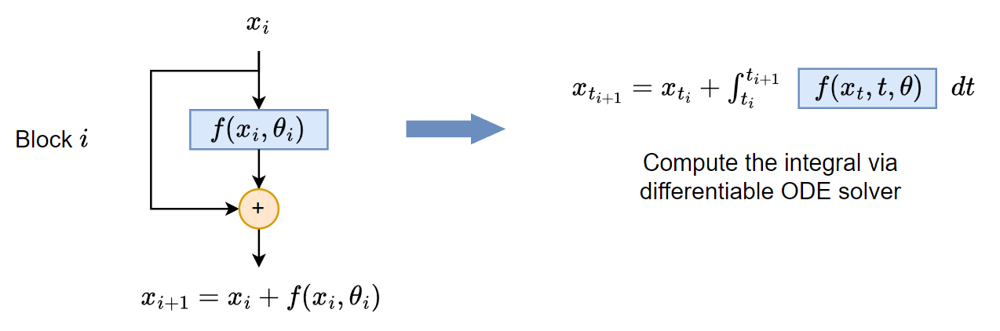

# Neural Ordinary Differential Equations    

## Introduction

A popular class of neural network architectures in many areas of machine learning are ResNets (He et al., 2015). 
ResNets have been initially introduced to address the vanishing gradient problem in deep networks, which made it difficult to train very deep networks. 
By introducing skip connections, ResNets allow for the direct flow of gradients through the network.
The input to a residual block is added to the output of the block, thus the gradient can flow directly from the output to the input of the block.

An illustration of a residual block is shown in the following figure (left):

The computation of the residual block at layer $i$ can be described mathematically as follows:
$$ \mathbf{x}_{i+1} = \mathbf{x}_i + \mathcal{f}(\mathbf{x}_i, \theta_i)$$
where $\mathbf{x}_i$ is the input to the block, $\mathbf{h}_{l+1}$ is the output of the block, $\mathcal{F}$ is the residual function, and $\theta_l$ are the parameters of the block.