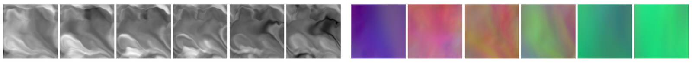

Outlook
=======================

Despite the lengthy discussions and numerous examples, we've really just barely scratched the surface regarding the possibilities that arise in the context of physics-based deep learning.

Most importantly, the techniques that were explained in the previous chapter have an enormous potential to influence all computational methods of the next decades. As demonstrated many times in the code examples, there's no magic involved, but deep learning gives us very powerful tools to represent and approximate non-linear functions. And deep learning by no means makes existing numerical methods deprecated. Rather, the two are an ideal combination.

A topic that we have not touched at all so far is, that -- of course -- in the end our goal is to improve human understanding of our world. And here the view of neural networks as "black boxes" is clearly outdated. It is simply another numerical method that humans can employ, and the physical fields predicted by a network are as interpretable as the outcome of a traditional simulation. Nonetheless, it is important to further improve the tools for analyzing learned networks, and to extract condensed formulations of the patterns and regularities the networks have found in the solution manifolds.




## Some specific directions

Beyond this long term outlook, there are many interesting and immediate steps.
And while the examples with Burgers equation and Navier-Stokes solvers are clearly non-trivial, there's a wide variety of other potential PDE models that the techniques of this book can be applied to. To name just a few promising examples from other fields:

* PDEs for chemical reactions often show complex behavior due to the interactions of multiple species. Here, and especially interesting direction is to train models that quickly learn to predict the evolution of an experiment or machine, and adjust control knobs to stabilize it, i.e., an online _control_ setting.

* Plasma simulations share a lot with vorticity-based formulations for fluids, but additionally introduce terms to handle electric and magnetic interactions within the material. Likewise, controllers for plasma fusion experiments and generators are an excellent topic with plenty of potential for DL with differentiable physics.

* Finally, weather and climate are crucial topics for humanity, and highly complex systems of fluid flows interacting with a multitude of phenomena on the surface of our planet. Accurately modeling all these interacting systems and predicting their long-term behavior shows a lot of promise to benefit from DL approaches that can interface with numerical simulations.


## Closing remarks

So overall, there's lots of exciting research work left to do - the next years and decades definitely won't be boring. 👍

```{figure} resources/logo.jpg
---
height: 200px
name: pbdl-logo-small
---
```

