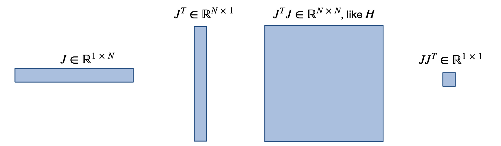
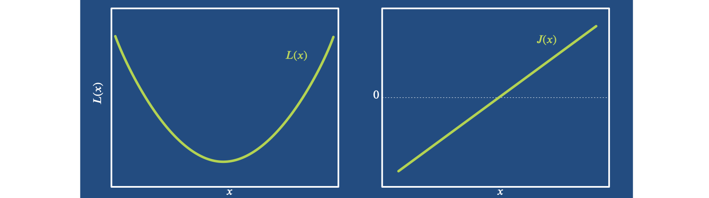

Optimization and Convergence
============================

This chapter will give an overview of the derivations for different optimization algorithms.
In contrast to other texts, we'll start with _the_ classic optimization algorithm, Newton's method,
derive several widely used variants from it, before coming back full circle to deep learning (DL) optimizers.
The main goal is the put DL into the context of these classical methods. While we'll focus on DL, we will also revisit
the classical algorithms for improved learning algorithms later on in this book. Physics simulations exaggerate the difficulties caused by neural networks, which is why the topics below have a particular relevance for physics-based learning tasks.

```{note} 
*Deep-dive Chapter*: This chapter is a deep dive for those interested in the theory of different optimizers. It will skip evaluations as well as source code, and instead focus on theory. The chapter is highly recommend as a basis for the chapters of {doc}`physgrad`. However, it is not "mandatory" for getting started with topics like training via _differentiable physics_. If you'd rather quickly get started with practical aspects, feel free to skip ahead to {doc}`supervised`.

```

## Notation

This chapter uses a custom notation that was carefully chosen to give a clear and 
brief representation of all methods under consideration.
We have a scalar loss function $L(x): \mathbb R^N \rightarrow \mathbb R$, the optimum (the minimum of $L$) is at location $x^*$,
and $\Delta$ denotes a step in $x$. Different intermediate update steps in $x$ are denoted by a subscript,
e.g., as $x_n$ or $x_k$.

In the  following, we often need inversions, i.e. a division by a certain quantity. 
For matrices $A$ and $B$, we define $\frac{A}{B} \equiv B^{-1} A$. 
When $a$ and $b$ are vectors, the result is a matrix obtained with one of the two formulations below. 
We'll specify which one to use:

$$
\frac{a}{b} \equiv \frac{a a^T}{a^T b } \text{  or  } \frac{a}{b} \equiv \frac{a b^T }{b^T b} 
$$ (vector-division)

% note, both divide by a scalar ; a a^T gives a symmetric matrix, a b^T not

% Only in this one chapter, the derivatives of $L(x)$ w.r.t. $x$ will be denoted by $'$. We won't use this in any other chapter, but as we're only dealing with derivatives of $x$ here, it will make some parts below a lot clearer.
%So, applying $\partial / \partial x$ once yields $L' \equiv J(x)$. As $J$ is a row vector, the gradient (column vector) $\nabla L$ is given by $J^T$. Applying $\partial / \partial x$ again gives the Hessian matrix $L'' \equiv H(x)$ And the third $\partial / \partial x$ gives the third derivative tensor $L''' \equiv K(x)$, which we luckily never need to compute as a full tensor, but which is required for some of the derivations below.

Applying $\partial / \partial x$ once to $L$ yields the Jacobian $J(x)$. As $L$ is scalar, $J$ is a row vector, and the gradient (column vector) $\nabla L$ is given by $J^T$.
Applying $\partial / \partial x$ again gives the Hessian matrix $H(x)$,
and another application of $\partial / \partial x$ gives the third derivative tensor denoted by $K(x)$. We luckily never need to compute $K$ as a full tensor, but it is needed for some of the derivations below. To shorten the notation below,
we'll typically drop the $(x)$ when a function or derivative is evaluated at location $x$, e.g., $J$ will denote $J(x)$.

The following image gives an overview of the resulting matrix shapes for some of the commonly used quantities.
We don't really need it afterwards, but for this figure $N$ denotes the dimension of $x$, i.e. $x \in \mathbb R^N$. 




## Preliminaries

We'll need a few tools for the derivations below, which are summarized here for reference.

Not surprisingly, we'll need some Taylor-series expansions. With the notation above it reads: 

$$L(x+\Delta) = L + J \Delta + \frac{1}{2} H \Delta^2 + \cdots$$

Then we also need the _Lagrange form_, which yields an exact solution for a $\xi$ from the interval $[x, x+\Delta]$:

$$L(x+\Delta) = L + J \Delta + \frac{1}{2} H(\xi) \Delta^2$$

In several instances we'll make use of the fundamental theorem of calculus, repeated here for completeness:   

$$f(x+\Delta) = f(x) + \int_0^1 \text{d}s ~ f'(x+s \Delta) \Delta \ . $$

In addition, we'll make use of Lipschitz-continuity with constant $\mathcal L$:
$|f(x+\Delta) + f(x)|\le \mathcal L \Delta$, and the well-known Cauchy-Schwartz inequality: 
$ u^T v < |u| \cdot |v| $.

## Newton's method

Now we can start with arguably the most classic algorithm for optimization: _Newton's method_. It is derived
by approximating the function we're interested in as a parabola. This can be motivated by the fact that pretty much every minimum looks like a parabola close up.



So we can represent $L$ near an optimum $x^*$ by a parabola of the form $L(x) = \frac{1}{2} H(x-x^*)^2 + c$, 
where $c$ denotes a constant offset. At location $x$ we observe $H$ and  
$J^T=H \cdot (x_k-x^*)$. Re-arranging this directly yields an equation to compute the minimum: $x^* = x_k - \frac{J^T}{H}$. 
Newton's method by default computes $x^*$ in a single step, and
hence the update in $x$ of Newton's method is given by:

$$
\Delta = - \frac{J^T}{H}
$$ (opt-newton)

Let's look at the order of convergence of Newton's method.
For an optimum $x^*$ of $L$, let
$\Delta_n^* = x^* - x_n$ denote the step from a current $x_n$ to the optimum, as illustrated below.


Assuming differentiability of $J$, 
we can perform the Lagrange expansion of $J^T$ at $x^*$:

$$\begin{aligned}
    0 = J^T(x^*)     &= J^T(x_n) + H(x_n) \Delta^*_n + \frac{1}{2} K (\xi_n ){\Delta^*_n}^2
        \\
       \frac{J^T}{H} &= -\frac{K}{2H}{\Delta^*_n}^2 - \Delta^*_n
\end{aligned}$$

In the second line, we've already divided by $H$, and dropped $(x_n)$ and $(\xi_n )$ to shorten the notation.
When we insert this into $\Delta_n^*$ we get:

$$\begin{aligned}
    {\Delta^*_{n+1}} &= x^* - x_{n+1} \\
    &= x^* - \big(   x_n - \frac{J^T}{H} \big)  \\
    &=  \Delta^*_n  - \frac{K}{2H} {\Delta^*_n}^2  - \Delta^*_n \\
    &=  - \frac{K}{2H} {\Delta^*_n}^2 
\end{aligned}$$

% simple: insert $\frac{J}{H}$ from above, re-arrange

Thus, the distance to the optimum changes by ${\Delta^*_n}^2$, which means once we're close enough 
we have quadratic convergence. This is great, of course, 
but it still depends on the pre-factor $\frac{K}{2H}$, and will diverge if its $>1$. 
Note that this is an exact expression, there's no truncation thanks to the Lagrange expansion.
And so far we have quadratic convergence, but the convergence to the optimum is not guaranteed.
For this we have to allow for a variable step size.

## Adaptive step size

Thus, as a next step for Newton's method we
introduce a variable step size $\lambda$ which gives the iteration 
$x_{n+1} = x_n + \lambda \Delta = x_n - \lambda \frac{J^T}{H}$.
As illustrated in the picture below, this is especially helpful if $L$ is not exactly
a parabola, and a small $H$ might overshoot in undesirable ways. The far left in this example:


To make statements about convergence, we need some fundamental assumptions: convexity and smoothness
of our loss function. Then we'll focus on showing that the loss decreases, and 
that we move along a sequence of smaller sets $\forall x ~ L(x)<L(x_n)$
with lower loss values.

First, we apply the fundamental theorem to L

$$
    L(x + \lambda \Delta) = L + \int_0^1 \text{ds}~ J(x + s \lambda \Delta) \lambda \Delta \ ,
$$

and likewise express $J$ around this location with it:

$$\begin{aligned}
    J(x + s \lambda \Delta) = J + s \lambda \Delta^T \int_0^1 \text{dt}~ H(x + s t \lambda \Delta) 
\end{aligned}$$

Inserting this $J^T$ into $L$ yields:

$$\begin{aligned}
    L(x + \lambda \Delta) - L(x) 
        &=  \int_0^1 \text{d}s \Big[    J + s \lambda \Delta^T  \int_0^1 \text{d}t~ H(x + s t \lambda \Delta)   \Big]^T  \lambda \Delta   \\
        &=  \int_0^1 \text{d}s \Big[   -H \Delta + \int_0^1 \text{d}t H(x + s t \lambda \Delta) ~ s \lambda \Delta  \Big]^T  \lambda \Delta    \\
        &=  \int_0^1 \text{d}s  \int_0^1 \text{d}t \big[  -H \Delta + H(x + s t \lambda \Delta) ~ s \lambda \Delta  \big]^T  \lambda \Delta    \\
        &=  \int_0^1 \text{d}s  \int_0^1 \text{d}t \big[  -H \Delta (1+\lambda s) + [ H(x + s t \lambda \Delta) - H ] ~ s \lambda \Delta  \big]^T  \lambda \Delta    \\
        &=  -(H\Delta)^T \big( 1+\frac{\lambda}{2} \big) \lambda \Delta  +  \lambda^2  \int_0^1 \text{d}s ~ s  \int_0^1 \text{d}t \big[ [ H(x + s t \lambda \Delta) - H ] ~ \Delta  \big]^T  \Delta    \\
\end{aligned}$$ (newton-step-size-conv1)

Here we've first used $\Delta = - J^T/H$, and moved it into the integral in the third line, alongside the $s \lambda \Delta$ term.
Line four factors out $H \Delta$. This allows us to evaluate the integral for the first term
$ -H \Delta (1+\lambda s)$ in the last line of equation {eq}`newton-step-size-conv1` above.

%         &=  -(H\Delta)^T \big( \lambda +\frac{\lambda^2}{2} \big)  + \lambda^2  \int_0^1 \text{d}s  \int_0^1 \text{d}t \big[ [ H(x + s t \lambda \Delta) - H ] ~ \Delta  \big]^T   \Delta    \\


In the next sequence of steps, we will first employ $(H\Delta)^T \Delta = \|H^{\frac{1}{2}}\Delta\|^2$. This term will be shortened to $\epsilon \equiv \| H^{\frac{1}{2}} \Delta \|^2$ in the second line below. Due to the properties of $H$, this $\epsilon$ "just" represents a small positive factor that will stick around till the end. 
Afterwards, in line 3 and 4 below, we can start finding an upper bound
for the change of the loss. We'll first use a Cauchy-Schwartz inequality, and then
make use of a special Lipschitz condition for affine conjugate matrices. For $H$, it takes the form $\| H(x)^{-\frac{1}{2}}\big( H(y)-H(x) \big) \| \le \mathcal L \| H(x)^{\frac{1}{2}} (y-x) \|^2$. This requires $H$ to by symmetric, positive-definite, which isn't too unreasonable in practice.
Continuing from above, we get:

$$\begin{aligned}
    \cdots 
    &=  - \big( \lambda +\frac{\lambda^2}{2} \big)   \| H^{\frac{1}{2}} \Delta \|^2  + \lambda^2 \int_0^1 \text{d}s ~ s  \int_0^1 \text{d}t \big[ [ H(x + s t \lambda \Delta) - H ] ~ \Delta  \big]^T   H^{-\frac{1}{2}} H^{\frac{1}{2}} \Delta    \\
    &=  -  \lambda \epsilon +\frac{\lambda^2 \epsilon}{2}   + \lambda^2 \int_0^1 \text{d}s ~ s  \int_0^1 \text{d}t \big[ H^{-\frac{1}{2}}  [ H(x + s t \lambda \Delta) - H ] ~ \Delta  \big]^T   H^{\frac{1}{2}} \Delta    \\
    &\le  -  \lambda \epsilon +\frac{\lambda^2 \epsilon}{2}   + \lambda^2 \int_0^1 \text{d}s ~ s  \int_0^1 \text{d}t \big\| H^{-\frac{1}{2}}  [ H(x + s t \lambda \Delta) - H ] ~ \Delta  \big\| ~  \| H^{\frac{1}{2}} \Delta \|    \\
    &\le  -  \lambda \epsilon +\frac{\lambda^2 \epsilon}{2}   + \lambda^3 \int_0^1 \text{d}s ~ s^2  \int_0^1 \text{d}t ~ t ~ \mathcal L \| H^{\frac{1}{2}} \Delta  \|^2 ~  \| H^{\frac{1}{2}} \Delta \|    \\
    &=  -  \lambda \epsilon +\frac{\lambda^2 \epsilon}{2}   +   \mathcal L \lambda^3 \int_0^1 \text{d}s ~ s^2  \int_0^1 \text{d}t ~ t ~ \| H^{\frac{1}{2}} \Delta  \|^3    \\
    &=  -  \lambda \epsilon +\frac{\lambda^2 \epsilon}{2}   +   \mathcal L \lambda^3 \int_0^1 \text{d}s ~ s^2  \int_0^1 \text{d}t ~ t ~ \epsilon^{\frac{3}{2}}    \\
    &=  -  \lambda \epsilon +\frac{\lambda^2 \epsilon}{2}   +  \frac{  \lambda^3 \mathcal L ~ \epsilon^{\frac{3}{2}}  }{6}
\end{aligned}$$ (newton-step-size-conv)

Due to $H^T = H$, we've moved $H^{-\frac{1}{2}}$ inside the integral in line 2. 
In line 4, we've pulled $s,t$ and $\lambda$ out of the integrals as much as possible, in addition to applying the special Lipschitz condition. The last three lines just simplify the terms, express the occurrences of $H$ in terms of $\epsilon$, and evaluate the integrals. This leaves us with a cubic form in terms of $\lambda$, the step size. Most importantly, the first, linear term is negative, and hence will dominate for small $\lambda$. With this we've shown that the step will be negative for sufficiently small $\lambda$:

$$L(x + \lambda \Delta) = L(x) -  \lambda \epsilon +\frac{\lambda^2 \epsilon}{2} + \frac{ \lambda^3 \mathcal L ~ \epsilon^{\frac{3}{2}} }{6}$$ (newton-ss-final)

However, this inherently requires us to freely choose $\lambda$, hence this proof 
is not applicable for the fixed step size above. A nice property of it is that 
we've "only" required Lipschitz continuity for $H$, not for $J$ or even $L$.

To conclude, we've shown that Newton's method with an adaptive step size provably converges, which is great. However, it requires the Hessian $H$ as a central ingredient. Unfortunately, $H$ very difficult to obtain in practice. This is a real show stopper, and motivates the following methods. They keep the basic step of Newton's method, but approximate $H$.

## Approximating the Hessian

Next, we will revisit three popular algorithms derived from Newton's method.

## Broyden's method

The first approach to approximate $H$ is to make a very rough guess,
namely to start with the identity matrix $H_0=\mathbf{1}$,
and then iterate to update $H_n$ via a finite difference approximation. 
For Broyden's method, we use the vector division $\frac{a}{b} \equiv \frac{a b^T }{b^T b}$.

For simplifying the finite difference, we'll additionally 
assume that we already have reached $J(x_n)=0$ at the current position $x_n$.
This is of course not necessarily true, but yields the following, nicely reduced expression
to modify $H$ over the course of the optimization:

$$
    H_{n+1} = H_n + \frac{J(x_{n+1})^T}{\Delta}
$$

As before, we use a step of $\Delta = -\frac{J^T}{H}$ for $x$, and the denominator comes from the finite difference
$\frac{ J(x_{n+1})^T - J(x_{n})^T }{\Delta}$ with the assumption that the current Jacobian is zero.
Keep in mind, that $\Delta$ is a vector here (see the vector division above), so the finite difference gives a matrix of size $N \times N$ that can be added to $H_n$.

Broyden's method has the advantage that we never have to compute a full Hessian, 
and the update of $H$ can be evaluated efficiently.
However, the two assumptions above make it a very rough approximation, and hence the
normalization of the update step via the inverse Hessian in $\frac{J^T}{H}$ is correspondingly unreliable.


## BFGS

This leads to the BFGS algorithm (named after _Broyden-Fletcher-Goldfarb-Shanno_), which introduces
some important improvements:
it does not assume $J$ to be zero immediately, and compensates for redundant parts of the updates.
This is necessary, as the finite difference $(J(x_{n+1}) - J(x_{n}) ) / \Delta_n$
gives a full approximation of $H$. We could try to perform some kind of averaging procedure, but
this would strongly deteriorate the existing content in $H_{n}$. Hence, we subtract
only the existing entries in $H_{n}$ along the current step $\Delta$. 
This makes sense, as the finite difference approximation yields exactly the estimate along
$\Delta$. In combination, using the vector division $\frac{a}{b} \equiv \frac{a a^T }{a^T b}$, 
these changes give an update step for $H$ of:

$$
  H_{n+1} = H_{n} + \frac{  J(x_{n+1})^T - J(x_{n})^T }{\Delta_n} - \frac{H_n \Delta_n}{\Delta_n}
$$

In practice, BFGS also makes use of a line search to determine the step size $\lambda$.
Due to the large size of $H$, commonly employed variants of BFGS also make use of reduced
representations of $H$ to save memory. Nonetheless, the core step of updating the Hessian
matrix via a finite difference approximation along the search direction lies at the core
of BFGS, and allows it to at least partially compensate for scaling effects of the 
loss landscape. Currently, BFGS-variants are the most widely used algorithm 
for solving classical non-linear optimization problems.

## Gauss-Newton

Another attractive variant of Newton's method can be derived by
restricting $L$ to be a classical $L^2$ loss. This gives the _Gauss-Newton_ (GN) algorithm.
Thus, we still use $\Delta = - \frac{J^T}{H}$ , but 
rely on a squared loss of the form $L=|f|^2$ for an arbitrary $f(x)$.
The derivatives of $f$ are denoted by $J_f, H_f$, in contrast to the
generic $J,H$ for $L$, as before.
Due to the chain rule, we have $J=2~f^T J_f$. 
% J chain rule; J_f matrix has f==m rows, right x==N columns; we need update in x

The second derivative yields the following expression. For GN, we simplify it by
omitting the second-order terms in the second line below: 

$$\begin{aligned}
    H &= 2 J_f^T J_f + 2 f^T H_f \\
    &\approx ~ 2 J_f^T J_f \\
    &= 2 \frac{J^TJ}{4|f|^2} \\
    &= \frac{J^TJ}{2L}
\end{aligned}$$ (gauss-newton-approx)

Here the remaining $J_f^T J_f$ term of the first order approximation can be simplified thanks
to our focus on an $L^2$ loss: $J_f= J / (2 f^T) $ and $|f|^2 = L$.

The last line of equation {eq}`gauss-newton-approx` means we are basically approximating the Hessian with $J$ squared. This is reasonable in many scenarios, and inserting it into our update step above gives the
Gauss-Newton update $\Delta_{\text{GN}} \approx -\frac{J^T}{J^T J}$.

Looking at this update, it essentially employs a step of the form  
$\Delta_{\text{GN}} \approx -\frac{1}{J}$, i.e., 
the update is based on an approximate inverse of the Jacobian of $L.$
This inverse gives an approximately equal step size in all parameters, and
as such provides an interesting building block that we will revisit in later chapters.
In the form above, it still means we have to invert a large matrix,
which is costly, and the matrix itself may not even be invertible.

---

## Back to Deep Learning

We've shown above that Newton's method lies at the heart of many popular algorithms for non-linear optimization. 
Gauss-Newton now finally provides us with a stepping stone back towards Deep Learning algorithms, specifically, to the Adam optimizer.


## Adam

As usual, we start with a Newton step $\Delta = - \lambda \frac{J^T}{H}$, but even the simplest approximation
of $H \approx J^T J$ from Gauss-Newton requires inverting a potentially huge matrix. This is not feasible for the weights of neural networks, and hence a valid question is, how can we further simplify this step? For Adam, the answer is: with a diagonal approximation. Specifically, Adam uses:

$$
    H \approx \sqrt{\text{diag}(J^TJ)}
$$ (h-approx-adam)

This is a very rough approximation of the true Hessian. We're simply using the squared, first derivatives here, and in general, of course, $\Big( \frac{\partial f}{\partial x} \Big)^2 \ne \frac{\partial^2 f}{\partial x^2}$.
This only holds for the first-order approximation from Gauss-Newton, i.e., the first term of equation {eq}`gauss-newton-approx`. Now Adam goes a step further, and only keeps the diagonal of $J^T J$. This quantity is readily available in deep learning in the form of the gradient of the weights, and makes the inversion of $H$ trivial. As a result, it at least provides some estimate of the curvature of the individual weights, but neglects their correlations.

Interestingly, Adam does not perform a full inversion via $\text{diag}(J^T J)$, but uses the component-wise square root.
This effectively yields $\sqrt{\text{diag}(J^T J)} \approx \sqrt{\text{diag}(J^2)} \approx \text{diag}(J)$.
Thus, Adam moves along $\Delta \approx \text{sign}(-J)$, approximately performing a step of fixed size along all dimensions.

In practice, Adam introduces a few more tricks by computing the gradient $J^T$ as well 
as the squared gradient with _momentum_, an averaging of both quantities over the course of the iterations of the optimization.
This makes the estimates more robust, which is crucial: a normalization with an erroneously small entry of the gradient could otherwise lead to an explosion. Adam additionally adds a small constant when dividing, and the square-root likewise helps to mitigate overshoot.

To summarize: Adam makes use of a first-order update with a diagonal Gauss-Newton approximation of the Hessian for normalization. It additionally employs momentum for stabilization.

## Gradient Descent

To arrive at gradient descent (GD) optimization, we now take the final step
to assume $H=1$ in $- \lambda \frac{J^T}{H}$. This leaves us with an update consisting of a scaled gradient $\Delta = - \lambda J^T$.


Interestingly, without any form of inversion, $J^T$ by itself has the right shape to be added to $x$,
but it "lives" in the wrong space $1/x$, rather than $x$ itself. 
This is illustrated by the fact that $J^{-1}$, as employed by all "classic" schemes above in some form,
is inherently different from $J^T$. This problem of a lacking inversion step is especially 
pronounced for problems involving physics, and hence one of the crucial take-away messages
of this chapter. We will revisit it in much more detail later on in {doc}`physgrad`.
For now, it's recommended to keep the relationships between the different algorithms in mind,
even when "just" using Adam or GD.

As a final step, let's look at the convergence of GD.
We again assume convexity and differentiability of $L$. 
Expanding a step of $\Delta$ with a Taylor series,
and bounding the second order term with a Lipschitz condition
$J(x+\Delta)-J(x) \le \mathcal L \Delta$, we get:

$$\begin{aligned}
    L(x+\Delta) - L(x) & \le J(x) \Delta + \frac{ \mathcal L}{2} |\Delta|^2 \\
      & = J (-\lambda J^T) + \frac{ \mathcal L}{2} |-\lambda J^T|^2 \\
      & = -\lambda J J^T + \lambda^2 \frac{ \mathcal L}{2} | J|^2 \\
      & = -\lambda |J|^2 +  \frac{ \lambda^2 \mathcal L}{2} | J|^2 \\
\end{aligned}$$

%      & \le - \frac{ \lambda}{2} | J|^2
% thus: $L(x+\Delta) \le L(x) -\lambda |J|^2 +  \frac{ \lambda^2 \mathcal L}{2} | J|^2$
% (Plus NNs not convex... plus ReLU not twice diff.able, H is zero everywhere and undefined in some places)

Like above for Newton's method in equation {eq}`newton-step-size-conv` we have a negative linear term
that dominates the loss for small enough $\lambda$.
In combination, we have the following upper bound due to the Lipschitz condition in the first line
$L(x+\Delta) \le L(x) - \lambda |J|^2 +  \frac{ \lambda^2 \mathcal L}{2} | J|^2 $.
By choosing $\lambda \le \frac{1}{\mathcal L}$, we can simplify these terms further, and can an upper bound that depends on $J$ squared: $L(x+\Delta) \le L(x) -  \frac{ \lambda}{2} | J|^2$
and thus ensures convergence.

This result unfortunately does not help us much in practice, as for all common usage of GD in deep learning $\mathcal L$ is not known. It is still good to know that a Lipschitz constant for the gradient would theoretically provide us with convergence guarantees for GD.

With this we conclude our tour of classical optimizers and their relation to deep learning methods. It's worth noting that we've focused on non-stochastic algorithms here for clarity, as the proofs would become more involved for stochastic algorithms.

---

With all this background knowledge, it a good time to start looking at some practical examples
that start as-simple-as-possible, with fully supervised approaches for training.
