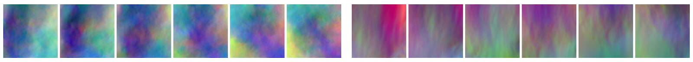
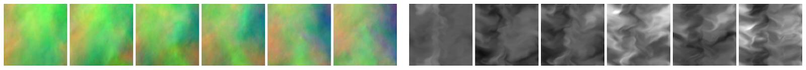

Scale-Invariance and Inversion
=======================

In the following we will question some fundamental aspects of the formulations so far, namely the update step computed via gradients.
To re-cap, the approaches explained in the previous chapters either dealt with purely _supervised_ training, integrated the physical model as a _physical loss term_ or included it via _differentiable physics_ (DP) operators embedded into the training graph. 
The latter two methods are more relevant in the context of this book. They share similarities, but in the loss term case, the physics evaluations are only required at training time. For DP approaches, the solver itself is usually also employed at inference time, which enables an end-to-end training of NNs and numerical solvers. All three approaches employ _first-order_ derivatives to drive optimizations and learning processes, and the latter two also using them for the physics terms.
This is a natural choice from a deep learning perspective, but we haven't questioned at all whether this is actually the best choice.

Not too surprising after this introduction: A central insight of the following chapter will be that regular gradients can be a _sub-optimal choice_ for learning problems involving physical quantities.
It turns out that both supervised and DP gradients have their pros and cons, and leave room for custom methods that are aware of the physics operators. 
In particular, we'll show how scaling problems of DP gradients affect NN training (as outlined in {cite}`holl2021pg`),
and revisit the problems of multi-modal solutions.
Finally, we'll explain several alternatives to prevent these issues. 

% It turns out that a key property that is missing in regular gradients is a proper _inversion_ of the Jacobian matrix.


```{admonition} A preview of this chapter
:class: tip

Below, we'll proceed in the following steps:
- Show how the properties of different optimizers and the associated scaling issues can negatively affect NN training.
- Identify the problem with our GD or Adam training runs so far. Spoiler: they're missing an _inversion_ process to make the training scale-invariant.
- We'll then explain two alternatives to alleviate these problems: an analytical full-, and a numerical half-inversion scheme.

```

% note, re-introduce multi-modality at some point...

## The crux of the matter

Before diving into the details of different optimizers, the following paragraphs should provide some intuition for why this inversion is important. As mentioned above, all methods discussed so far use gradients, which come with fundamental scaling issues: even for relatively simple linear cases, the direction of the gradient can be negatively distorted, thus preventing effective progress towards the minimum. (In non-linear settings, the length of the gradient anticorrelates with the distance from the minimum point, making it even more difficult to converge.)

In 1D, this problem can alleviated by tweaking the learning rate, but it becomes very clear in higher dimensions. Let's consider a very simple toy "physics" function in two dimensions that simply applies a factor $\alpha$ to the second component, followed by an $L^2$ loss:

$$ \mathcal P(x_1,x_2) = 
\begin{bmatrix} 
  x_1 \\
  \alpha ~ x_2
\end{bmatrix}  \text{ with }  L(\mathcal P) = |\mathcal P|^2 
$$

For $\alpha=1$ everything is very simple: we're faced with a radially symmetric loss landscape, and $x_1$ and $x_2$ behave in the same way. The gradient $\nabla_x = (\partial L / \partial x)^T$ is perpendicular to the isolines of the loss landscape, and hence an update with $-\eta \nabla_x$ points directly to the minimum at 0. This is a setting we're dealing with for classical deep learning scenarios, like most supervised learning cases or classification problems. This example is visualized on the left of the following figure.

```{figure} resources/physgrad-scaling.jpg
---
height: 200px
name: physgrad-scaling
---
Loss landscapes in $x$ for different $\alpha$ of the 2D example problem. The green arrows visualize an example update step $- \nabla_x$ (not exactly to scale) for each case.
```

However, within this book we're targeting _physical_ learning problems, and hence we have physical functions integrated into the learning process, as discussed at length for differentiable physics approaches. This is fundamentally different! Physical processes pretty much always introduce different scaling behavior for different components: some changes in the physical state are sensitive and produce massive responses, others have barely any effect. In our toy problem we can mimic this by choosing different values for $\alpha$, as shown in the middle and right graphs of the figure above.

For larger $\alpha$, the loss landscape away from the minimum steepens along $x_2$. $x_1$ will have an increasingly different scale than $x_2$. As a consequence, the gradients grow along this $x_2$. If we don't want our optimization to blow up, we'll need to choose a smaller learning rate $\eta$, reducing progress along $x_1$. The gradient of course stays perpendicular to the loss. In this example we'll move quickly along $x_2$ until we're close to the x axis, and then only very slowly creep left towards the minimum. Even worse, as we'll show below, regular updates actually apply the square of the scaling! 
And in settings with many dimensions, it will be extremely difficult to find a good learning rate.
Thus, to make proper progress, we somehow need to account for the different scaling of the components of multi-dimensional functions. This requires some form of _inversion_, as we'll outline in detail below. 

Note that inversion, naturally, does not mean negation ($g^{-1} \ne -g$ 🙄). A negated gradient would definitely move in the wrong direction. We need an update that still points towards a decreasing loss, but accounts for differently scaled dimensions. Hence, a central aim in the following will be _scale-invariance_.

```{admonition} Definition of *scale-invariance*
:class: tip
A scale-invariant optimization for a given function yields the same result for different parametrizations (i.e. scalings) of the function. 
```

E.g., for our toy problem above this means that optimization trajectories are identical no matter what value we choose for $\alpha$.





## Traditional optimization methods

We'll now evaluate and discuss how different optimizers perform in comparison. As before, let $L(x)$ be a scalar loss function, subject to minimization. The goal is to compute a step in terms of the input parameters $x$ , denoted by $\Delta x$. Below, we'll compute different versions of $\Delta x$ that will be distinguished by a subscript.

All NNs of the previous chapters were trained with gradient descent (GD) via backpropagation. GD with backprop was also employed for the PDE solver (_simulator_) $\mathcal P$, resulting in the DP training approach.
When we simplify the setting, and leave out the NN for a moment, this gives the minimization problem
$\text{arg min}_{x} ~ L(x)$ with $L(x) = 1/2 ~ \| \mathcal P(x) - y^* \|_2^2$.
As a central quantity, we have the composite gradient 
$(\partial L / \partial x)^T$ of the loss function $L$:

$$
\Big( \frac{\partial L}{\partial x} \Big)^T = 
    \Big( \frac{\partial \mathcal P}{\partial x} \Big)^T
    \Big( \frac{\partial L}{\partial \mathcal P} \Big)^T
$$ (loss-deriv)

As the $(\cdots)^T$ notation makes things difficult to read, and we're effectively only dealing with transposed Jacobians, we'll omit the $^T$ in the following.

We've shown in previous chapters that using $\partial L/\partial x$ works, but
in the field of classical optimization, other algorithms are more widely used than GD: popular are so-called Quasi-Newton methods, which use fundamentally different updates.
Hence, in the following we'll revisit GD along with Quasi-Newton methods and Inverse Jacobians as a third alternative. We'll focus on the pros and cons of the different methods on a theoretical level. Among others, it's interesting to discuss why classical optimization algorithms aren't widely used for NN training despite having some obvious advantages.

Note that we exclusively consider multivariate functions, and hence all symbols represent vector-valued expressions unless noted otherwise.

%techniques such as Newton's method or BFGS variants are commonly used to optimize numerical processes since they can offer better convergence speed and stability. These methods likewise employ gradient information, but substantially differ from GD in the way they compute the update step, typically via higher order derivatives.

%```{figure} resources/placeholder.png
%---
%height: 220px
%name: pg-training
%---
%TODO, visual overview of PG training
%```


## Gradient descent

The optimization updates $\Delta x_{\text{GD}}$ of GD scale with the derivative of the objective w.r.t. the inputs,

$$
    \Delta x_{\text{GD}} = -\eta \cdot \frac{\partial L}{\partial x}
$$ (GD-update)

where $\eta$ is the scalar learning rate.
The Jacobian $\frac{\partial L}{\partial x}$ describes how the loss reacts to small changes of the input.
Surprisingly, this very widely used update has a number of undesirable properties that we'll highlight in the following. Note that we've naturally applied this update in supervised settings such as {doc}`supervised-airfoils`, but we've also used it in the differentiable physics approaches. E.g., in {doc}`diffphys-code-sol` we've computed the derivative of the fluid solver. In the latter case, we've still only updated the NN parameters, but the fluid solver Jacobian was part of equation {eq}`GD-update`, as shown in {eq}`loss-deriv`.

We'll jointly evaluate GD and several other methods with respect to a range of categories: their handling of units, function sensitivity, and behavior near optima. While these topics are related, they illustrate differences and similarities of the approaches.


**Units** 📏

A first indicator that something is amiss with GD is that it inherently misrepresents dimensions.
Assume two parameters $x_1$ and $x_2$ have different physical units.
Then the GD parameter updates scale with the inverse of these units because the parameters appear in the denominator for the GD update above ($\cdots / \partial x$).
The learning rate $\eta$ could compensate for this discrepancy but since $x_1$ and $x_2$ have different units, there exists no single $\eta$ to produce the correct units for both parameters.

One could argue that units aren't very important for the parameters of NNs, but nonetheless it's unnerving from a physics perspective that they're wrong, and it hints at some more fundamental problems.

**Function sensitivity** 🔍

As illustrated above, GD has also inherent problems when functions are not _normalized_.
Consider a simplified version of the toy example above, consisting only of the function $L(x) = \alpha \cdot x$.
Then the parameter updates of GD scale with $\alpha$, i.e. $\Delta x_{\text{GD}} = -\eta \cdot \alpha$, and 
$L(x+\Delta x_{\text{GD}})$ will even have terms on the order of $\alpha^2$.
If $L$ is normalized via $\alpha=1$, everything's fine. But in practice, we'll often
have $\alpha \ll 1$, or even worse $\alpha \gg 1$, and then our optimization will be in trouble.

More specifically, if we look at how the loss changes, the expansion around $x$ for
the update step of GD gives:
$L(x+\Delta x_{\text{GD}}) = L(x)  + \Delta x_{\text{GD}} \frac{\partial L}{\partial x}  + \cdots $.
This first-order step causes a change in the loss of
$\big( L(x) - L(x+\Delta x_{\text{GD}}) \big) = -\eta \cdot (\frac{\partial L}{\partial x})^2 + \mathcal O(\Delta x^2)$. Hence the loss changes by the squared derivative, which leads to the $\alpha^2$ factor mentioned above. Even worse, in practice we'd like to have a normalized quantity here. For a scaling of the gradients by $\alpha$, we'd like our optimizer to compute a quantity like $1/\alpha^2$, in order to get a reliable update from the gradient. 

This demonstrates that
for sensitive functions, i.e. functions where _small changes_ in $x$ cause _large_ changes in $L$, GD counter-intuitively produces large $\Delta x_{\text{GD}}$. This causes even larger steps in $L$, and leads to exploding gradients.
For insensitive functions where _large changes_ in the input don't change the output $L$ much, GD produces _small_ updates, which can lead to the optimization coming to a halt. That's the classic _vanishing gradients_ problem.

Such sensitivity problems can occur easily in complex functions such as deep neural networks where the layers are typically not fully normalized.
Normalization in combination with correct setting of the learning rate $\eta$ can be used to counteract this behavior in NNs to some extent, but these tools are not available when optimizing physics simulations.
Applying normalization to a simulation anywhere but after the last solver step would destroy the state of the simulation.
Adjusting the learning rate is also difficult in practice, e.g., when simulation parameters at different time steps are optimized simultaneously or when the magnitude of the simulation output varies w.r.t. the initial state.


**Convergence near optimum** 💎

Finally, the loss landscape of any differentiable function necessarily becomes flat close to an optimum,
as the gradient approaches zero upon convergence.
Therefore $\Delta x_{\text{GD}} \rightarrow 0$ as the optimum is approached, resulting in slow convergence.

This is an important point, and we will revisit it below. It's also somewhat surprising at first, but it can actually
stabilize the training. On the other hand, it makes the learning process difficult to control.


## Quasi-Newton methods

Newton's method employs the gradient $\frac{\partial L}{\partial x}$ and the inverse of the Hessian $\frac{\partial^2 L}{\partial x^2}$ for the update 

$$
\Delta x_{\text{QN}} = -\eta \cdot \left( \frac{\partial^2 L}{\partial x^2} \right)^{-1} \frac{\partial L}{\partial x} .
$$ (quasi-newton-update)

More widely used in practice are Quasi-Newton methods, such as BFGS and its variants, which approximate the Hessian matrix.
However, the resulting update $\Delta x_{\text{QN}}$ stays the same.
As a further improvement, the step size $\eta$ is often determined via a line search (we'll leave out this step for now).
This construction solves some of the problems of gradient descent from above, but has other drawbacks.

**Units and Sensitivity** 📏

Quasi-Newton methods definitely provide a much better handling of physical units than GD.
The quasi-Newton update from equation {eq}`quasi-newton-update`
produces the correct units for all parameters to be optimized. 
As a consequence, $\eta$ can stay dimensionless.

If we now consider how the loss changes via
$L(x+\Delta x_{\text{QN}}) = L(x) + -\eta \cdot \left( \frac{\partial^2 L}{\partial x^2} \right)^{-1} \frac{\partial L}{\partial x} \frac{\partial L}{\partial x}  + \cdots $ , the second term correctly cancels out the $x$ quantities, and leaves us with a scalar update in terms of $L$. Thinking back to the example with a scaling factor $\alpha$ from the GD section, the inverse Hessian in Newton's methods successfully gives us a factor of $1/\alpha^2$ to counteract the undesirable scaling of our updates.

**Convergence near optimum** 💎

Quasi-Newton methods also exhibit much faster convergence when the loss landscape is relatively flat.
Instead of slowing down, they take larger steps, even when $\eta$ is fixed.
This is thanks to the eigenvalues of the inverse Hessian, which scale inversely with the eigenvalues of the Hessian, and hence increase with the flatness of the loss landscape.


**Consistency in function compositions** 

So far, quasi-Newton methods address both shortcomings of GD. 
However, similar to GD, the update of an intermediate space still depends on all functions before that.
This behavior stems from the fact that the Hessian of a composite function carries non-linear terms of the gradient.

Consider a function composition $L(y(x))$, with $L$ as above, and an additional function $y(x)$.
Then the Hessian $\frac{d^2L}{dx^2} = \frac{\partial^2L}{\partial y^2} \left( \frac{\partial y}{\partial x} \right)^2 + \frac{\partial L}{\partial y} \cdot \frac{\partial^2 y}{\partial x^2}$ depends on the square of the inner Jacobian $\frac{\partial y}{\partial x}$. 
This means that if we'd use this update in a backpropagation step, the Hessian is influenced by the _later_ functions of the backprop chain.
As a consequence, the update of any intermediate latent space is unknown during the computation of the gradients.

% chain of function evaluations: Hessian of an outer function is influenced by inner ones; inversion corrects and yields quantity similar to IG, but nonetheless influenced by "later" derivatives


**Dependence on Hessian** 🎩

In addition, a fundamental disadvantage of quasi-Newton methods that becomes apparent from the discussion above is their dependence on the Hessian. It plays a crucial role for all the improvements discussed so far.

The first obvious drawback is the _computational cost_.
While evaluating the exact Hessian only adds one extra pass to every optimization step, this pass involves higher-dimensional tensors than the computation of the gradient.
As $\frac{\partial^2 L}{\partial x^2}$ grows with the square of the parameter count, both its evaluation and its inversion become very expensive for large systems. This is where Quasi-Newton methods spend significant efforts to compute approximations with a reasonable amount of resources, but it's nonetheless a central problem.

% Many algorithms therefore avoid computing the exact Hessian and instead approximate it by accumulating the gradient over multiple update steps. The memory requirements also grow quadratically.

The quasi-Newton update above additionally requires the _inverse_ Hessian matrix. Thus, a Hessian that is close to being non-invertible typically causes numerical stability problems, while inherently non-invertible Hessians require a fallback to a first order GD update.

Another related limitation of quasi-Newton methods is that the objective function needs to be _twice-differentiable_.
While this may not seem like a big restriction, note that many common neural network architectures use ReLU activation functions of which the second-order derivative is zero.
%
Related to this is the problem that higher-order derivatives tend to change more quickly when traversing the parameter space, making them more prone to high-frequency noise in the loss landscape.

```{note} 
_Quasi-Newton Methods_
are still a very active research topic, and hence many extensions have been proposed that can alleviate some of these problems in certain settings. E.g., the memory requirement problem can be sidestepped by storing only lower-dimensional vectors that can be used to approximate the Hessian. However, these difficulties illustrate the problems that often arise when applying methods like BFGS.
```

%\nt{In contrast to these classic algorithms, we will show how to leverage invertible physical models to efficiently compute physical update steps. In certain scenarios, such as simple loss functions, computing the inverse  gradient via the inverse Hessian will also provide a useful building block for our final algorithm.}
%, and how to they can be used to improve the training of neural networks.





## Inverse gradients

As a first step towards fixing the aforementioned issues,
we'll consider what we'll call _inverse_ gradients (IGs). These methods actually use an inverse of the Jacobian, but as we always have a scalar loss at the end of the computational chain, this results in a gradient vector.
Unfortunately, they come with their own set of problems, which is why they only represent an intermediate step (we'll revisit them in a more practical form later on).

Instead of $L$ (which is scalar), let's consider optimization problems for a generic, potentially non-scalar function $y(x)$. 
This will typically be the physical simulator $\mathcal P$ later on, but to keep things general and readable, we'll call it $y$ for now. This setup implies an inverse problem: for $y = \mathcal P(x)$ we want to find an $x$ given a target $y^*$.
We define the update

$$
    \Delta x_{\text{IG}} = \frac{\partial x}{\partial y} \cdot \Delta y.
$$ (IG-def)

to be the IG update.
Here, the Jacobian $\frac{\partial x}{\partial y}$, which is similar to the inverse of the GD update above, encodes with first-order accuracy how the inputs must change in order to obtain a small change $\Delta y$ in the output.
The crucial step is the inversion, which of course requires the Jacobian matrix to be invertible. This is a problem somewhat similar to the inversion of the Hessian, and we'll revisit this issue below. However, if we can invert the Jacobian, this has some very nice properties.

Note that instead of using a learning rate, here the step size is determined by the desired increase or decrease of the value of the output, $\Delta y$. Thus, we need to choose a $\Delta y$ instead of an $\eta$, but effectively has the same role: it controls the step size of the optimization.
It the simplest case, we can compute it as a step towards the ground truth via $\Delta y = \eta ~ (y^* - y)$.
This $\Delta y$ will show up frequently in the following equations, and make them look quite different to the ones above at first sight. 


% **Positive Aspects** 
**Units** 📏

IGs scale with the inverse derivative. Hence the updates are automatically of the same units as the parameters without requiring an arbitrary learning rate: $\frac{\partial x}{\partial y}$ times $\Delta y$ has the units of $x$.

**Function sensitivity** 🔍

They also don't have problems with normalization as the parameter updates from the example $L(x) = \alpha \cdot x$ above now scale with $\alpha^{-1}$.
Sensitive functions thus receive small updates while insensitive functions get large (or exploding) updates.

**Convergence near optimum and function compositions** 💎

Like Newton's method, IGs show the opposite behavior of GD close to an optimum: they produce updates that still progress the optimization, which usually improves  convergence.

Additionally, IGs are consistent in function composition.
The change in $x$ is $\Delta x_{\text{IG}} = \Delta L \cdot \frac{\partial x}{\partial y} \frac{\partial y}{\partial L}$ and the approximate change in $y$ is $\Delta y = \Delta L  \cdot \frac{\partial y}{\partial x} \frac{\partial x}{\partial y} \frac{\partial y}{\partial L} = \Delta L \frac{\partial y}{\partial L}$.
The change in intermediate spaces is independent of their respective dependencies, at least up to first order.
Consequently, the change to these spaces can be estimated during backprop, before all gradients have been computed.

Note that even Newton's method with its inverse Hessian didn't fully get this right. The key here is that if the Jacobian is invertible, we'll directly get the correctly scaled direction at a given layer, without helper quantities such as the inverse Hessian.

% **Consistency in function compositions**
% In the example in table~\ref{tab:function-composition-example}, the change $\Delta y$ is the same no matter what space is used as optimization target.

**Dependence on the inverse Jacobian** 🎩

So far so good. The above properties are clearly advantageous, but unfortunately IGs
require the inverse of the Jacobian, $\frac{\partial x}{\partial y}$.
It is only well-defined for square Jacobians, meaning for functions $y$ with the same inputs and output dimensions.
In optimization, however, the input is typically high-dimensional while the output is a scalar objective function.
And, somewhat similar to the Hessians of quasi-Newton methods, 
even when the $\frac{\partial y}{\partial x}$ is square, it may not be invertible.

Thus, we now consider the fact that inverse gradients are linearizations of inverse functions and show that using inverse functions provides additional advantages while retaining the same benefits.

% --- split --- ?

---

## Inverse simulators

So far we've discussed the problems of existing methods, and a common theme among the methods that do better, Newton and IGs, is that the regular gradient is not sufficient. We somehow need to address it's problems with some form of _inversion_ to arrive at scale invariance. Before going into details of NN training and numerical methods to perform this inversion, we will consider one additional "special" case that will further illustrate the need for inversion: if we can make use of an _inverse simulator_, this likewise addresses many of the inherent issues of GD. It actually represents the ideal setting for computing update steps for the physics simulation part.

Let $y = \mathcal P(x)$ be a forward simulation, and $\mathcal P(y)^{-1}=x$ denote its inverse. 
In contrast to the inversion of Jacobian or Hessian matrices from before, $\mathcal P^{-1}$ denotes a full inverse of all functions of $\mathcal P$. 

Trying to this employ inverse solver in the minimization problem from the top, somewhat surprisingly, makes the whole minimization obsolete (at least if we consider single cases with one $x,y^*$ pair). We just need to evaluate $\mathcal P^{-1}(y^*)$ to solve the inverse problem and obtain $x$. As we plan to bring back NNs and more complex scenarios soon, let's assume that we are still dealing with a collection of $y^*$ targets, and non-obvious solutions $x$. One example could be that we're looking for an $x$ that yields multiple $y^*$ targets with minimal distortions in terms of $L^2$.

Now, instead of evaluating $\mathcal P^{-1}$ once to obtain the solution, we can iteratively update a current approximation of the solution $x_0$ with an update that we'll call $\Delta x_{\text{PG}}$ when employing the inverse physical simulator.

It also turns out to be a good idea to employ a _local_ inverse that is conditioned on an initial guess for the solution $x$. We'll denote this local inverse with $\mathcal P^{-1}(y^*; x)$. As there are potentially very different $x$-space locations that result in very similar $y^*$, we'd like to find the one closest to the current guess. This is important to obtain well behaved solutions in multi-modal settings, where we'd like to avoid the solution manifold to consist of a set of very scattered points.

Equipped with these changes, we can formulate an optimization problem where a current state of the optimization $x_0$, with $y_0 = \mathcal P(x_0)$, is updated with 

$$
    \Delta x_{\text{PG}}  =  \frac{ \big( \mathcal P^{-1} (y_0 + \Delta y; x_0) - x_0  \big) }{\Delta y} \cdot \Delta y . 
$$ (PG-def)


Here the step in $y$-space, $\Delta y$, is either the full distance $y^*-y_0$ or a part of it, in line with the $y$-step used for IGs. 
When applying the update $ \mathcal P^{-1}(y_0 + \Delta y; x_0) - x_0$ it will produce $\mathcal P(x_0 + \Delta x) = y_0 + \Delta y$ exactly, despite $\mathcal P$ being a potentially highly nonlinear function.
Note that the $\Delta y$ in equation {eq}`PG-def` effectively cancels out to give a step in terms of $x$. However, this notation serves to show the similarities with the IG step from equation {eq}`IG-def`.
The update $\Delta x_{\text{PG}}$ gives us a first iterative method that makes use of $\mathcal P^{-1}$, and as such leverages all its information, such as higher-order terms. 

## Summary

The update obtained with a regular gradient descent method has surprising shortcomings due to scaling issues.
Classical, inversion-based methods like IGs and Newton's method remove some of these shortcomings,
with the somewhat theoretical construct of the update from inverse simulators ($\Delta x_{\text{PG}}$)
including the most higher-order terms.
$\Delta x_{\text{PG}}$ can be seen as an "ideal" setting for improved (inverted) update steps. 
It gets all of the aspect above right: units 📏, function sensitivity 🔍, compositions, and convergence near optima 💎,
and it provides a _scale-invariant_ update.
This comes at the cost of requiring an expression and discretization for a local inverse solver. 🎩

In contrast to the second- and first-order approximations from Newton's method and IGs, it can potentially take highly nonlinear effects into account. Due to the potentially difficult construct of the inverse simulator, the main goal of the following sections is to illustrate how much we can gain from including all the higher-order information. Note that all three methods successfully include a rescaling of the search direction via inversion, in contrast to the previously discussed GD training. All of these methods represent different forms of differentiable physics, though.

Before moving on to including improved updates in NN training processes, we will discuss some additional theoretical aspects, 
and then illustrate the differences between these approaches with a practical example.


```{note} 
The following sections will provide an in-depth look ("deep-dive"), into 
optimizations with inverse solvers. If you're interested in practical examples
and connections to NNs, feel free to skip ahead to {doc}`physgrad-comparison` or 
{doc}`physgrad-nn`, respectively.
```


## Deep Dive into Inverse simulators

We'll now derive and discuss the $\Delta x_{\text{PG}}$ update in more detail.
Physical processes can be described as a trajectory in state space where each point represents one possible configuration of the system.
A simulator typically takes one such state space vector and computes a new one at another time.
The Jacobian of the simulator is, therefore, necessarily square.
As long as the physical process does _not destroy_ information, the Jacobian is non-singular.
In fact, it is believed that information in our universe cannot be destroyed so any physical process could in theory be inverted as long as we have perfect knowledge of the state.
Hence, it's not unreasonable to expect that $\mathcal P^{-1}$ can be formulated in many settings.

Update steps computed as described above also have some nice theoretical properties, e.g., that the optimization converges given that $\mathcal P^{-1}$ consistently a fixed target $x^*$. Details of the corresponding proofs can be found in {cite}`holl2021pg`.

% We now show that these terms can help produce more stable updates than the IG alone, provided that $\mathcal P_{(x_0,z_0)}^{-1}$ is a sufficiently good approximation of the true inverse.
% Let $\mathcal P^{-1}(z)$ be the true inverse function to $\mathcal P(x)$, assuming that $\mathcal P$ is fully invertible.

### Fundamental theorem of calculus

To more clearly illustrate the advantages in non-linear settings, we
apply the fundamental theorem of calculus to rewrite the ratio $\Delta x_{\text{PG}} / \Delta y$ from above. This gives, 

% \begin{equation} \label{eq:avg-grad}

% $\begin{aligned}
%     \frac{\Delta z}{\Delta x} = \frac{\int_{x_0}^{x_0+\Delta x} \frac{\partial z}{\partial x} \, dx}{\Delta x}
% \end{aligned}$

% where we've integrated over a trajectory in $x$, and 
% focused on 1D for simplicity. Likewise, by integrating over $z$ we can obtain:

$$\begin{aligned}
    \frac{\Delta x_{\text{PG}}}{\Delta y} = \frac{\int_{y_0}^{y_0+\Delta y} \frac{\partial x}{\partial y} \, dy}{\Delta y}
\end{aligned}$$

Here the expressions inside the integral is the local gradient, and we assume it exists at all points between $y_0$ and $y_0+\Delta y_0$.
The local gradients are averaged along the path connecting the state before the update with the state after the update.
The whole expression is therefore equal to the average gradient of $\mathcal P$ between the current $x$ and the estimate for the next optimization step $x_0 + \Delta x_{\text{PG}}$.
This effectively amounts to _smoothing the objective landscape_ of an optimization by computing updates that can take nonlinearities of $\mathcal P$ into account.

The equations naturally generalize to higher dimensions by replacing the integral with a path integral along any differentiable path connecting $x_0$ and $x_0 + \Delta x_{\text{PG}}$ and replacing the local gradient by the local gradient in the direction of the path.


### Global and local inverse simulators

Let $\mathcal P$ be a function with a square Jacobian and $y = \mathcal P(x)$.
A global inverse function $\mathcal P^{-1}$ is defined only for bijective $\mathcal P$. 
If the inverse exists, it can find $x$ for any $y$ such that $y = \mathcal P(x)$.

Instead of using this "perfect" inverse $\mathcal P^{-1}$ directly, we'll in practice often use a local inverse
$\mathcal P^{-1}(y; x_0)$, which is conditioned for the point $x_0$, and correspondingly on 
$y_0=\mathcal P(x_0)$. 
This local inverse is easier to obtain, as it only needs to exist near a given $y_0$, and not for all $y$. 
For the generic $\mathcal P^{-1}$ to exist $\mathcal P$ would need to be globally invertible.

By contrast, a _local inverse_ only needs to exist and be accurate in the vicinity of $(x_0, y_0)$.
If a global inverse $\mathcal P^{-1}(y)$ exists, the local inverse approximates it and matches it exactly as $y \rightarrow y_0$.
More formally, $\lim_{y \rightarrow y_0} \frac{\mathcal P^{-1}(y; x_0) - P^{-1}(y)}{|y - y_0|} = 0$.
Local inverse functions can exist, even when a global inverse does not.

Non-injective functions can be inverted, for example, by choosing the closest $x$ to $x_0$ such that $\mathcal P(x) = y$.
As an example, consider $\mathcal P(x) = x^2$. It doesn't have a global inverse as two solutions ($\pm$) exist for each $y$. However, we can easily construct a local inverse by choosing the closest solution taking from an initial guess.

For differentiable functions, a local inverse is guaranteed to exist by the inverse function theorem as long as the Jacobian is non-singular.
That is because the inverse Jacobian $\frac{\partial x}{\partial y}$ itself is a local inverse function, albeit, with being first-order, not the most accurate one.
Even when the Jacobian is singular (because the function is not injective, chaotic or noisy), we can usually find good local inverse functions.


### Time reversal

The inverse function of a simulator is typically the time-reversed physical process.
In some cases, inverting the time axis of the forward simulator, $t \rightarrow -t$, can yield an adequate global inverse simulator.
Unless the simulator destroys information in practice, e.g., due to accumulated numerical errors or stiff linear systems, this  approach can be a starting point for an inverse simulation, or to formulate a _local_ inverse simulation.

However, the simulator itself needs to be of sufficient accuracy to provide the correct estimate. For more complex settings, e.g., fluid simulations over the course of many time steps, the first- and second-order schemes as employed in {doc}`overview-ns-forw` would not be sufficient.


### Integrating a loss function

Since introducing IGs, we've only considered a simulator with an output $y$. Now we can re-introduce the loss function $L$. 
As before, we consider minimization problems with a scalar objective function $L(y)$ that depends on the result of an invertible simulator $y = \mathcal P(x)$. 
In equation {eq}`IG-def` we've introduced the inverse gradient (IG) update, which gives $\Delta x = \frac{\partial x}{\partial L} \cdot \Delta L$ when the loss function is included.
Here, $\Delta L$ denotes a step to take in terms of the loss. 

By applying the chain rule and substituting the IG $\frac{\partial x}{\partial L}$ for the update from the inverse physics simulator from equation {eq}`PG-def`, we obtain, up to first order:

$$
\begin{aligned}
    \Delta x_{\text{PG}}
    &= \frac{\partial x}{\partial L} \cdot \Delta L
    \\
    &= \frac{\partial x}{\partial y} \left( \frac{\partial y}{\partial L} \cdot \Delta L \right)
    \\
    &= \frac{\partial x}{\partial y} \cdot \Delta y
    \\
    &= \mathcal P^{-1}(y_0 + \Delta y; x_0) - x_0 + \mathcal O(\Delta y^2)
\end{aligned}
$$

These equations show that equation {eq}`PG-def` is equal to the IG from the section above up to first order, but contains nonlinear terms, i.e.
$ \Delta x_{\text{PG}} / \Delta y = \frac{\partial x}{\partial y} + \mathcal O(\Delta y^2) $.
The accuracy of the update depends on the fidelity of the inverse function $\mathcal P^{-1}$.
We can define an upper limit to the error of the local inverse using the local gradient $\frac{\partial x}{\partial y}$.
In the worst case, we can therefore fall back to the regular gradient.

Also, we have turned the step w.r.t. $L$ into a step in $y$ space: $\Delta y$. 
However, this does not prescribe a unique way to compute $\Delta y$ since the derivative $\frac{\partial y}{\partial L}$ as the right-inverse of the row-vector $\frac{\partial L}{\partial y}$ puts almost no restrictions on $\Delta y$.
Instead, we use a Newton step from equation {eq}`quasi-newton-update` to determine $\Delta y$ where $\eta$ controls the step size of the optimization steps. We will explain this in more detail in connection with the introduction of NNs after the following code example.

