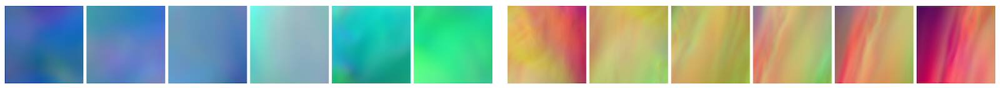

Physical Loss Terms
=======================

The supervised setting of the previous sections can quickly 
yield approximate solutions with a fairly simple training process. However, what's
quite sad to see here is that we only use physical models and numerical methods 
as an "external" tool to produce a big pile of data 😢.

We as humans have a lot of knowledge about how to describe physical processes
mathematically. As the following chapters will show, we can improve the
training process by guiding it with our human knowledge of physics.




## Using physical models

Given a PDE for $\mathbf{u}(\mathbf{x},t)$ with a time evolution, 
we can typically express it in terms of a function $\mathcal F$ of the derivatives 
of $\mathbf{u}$ via  

$$
  \mathbf{u}_t = \mathcal F ( \mathbf{u}_{x}, \mathbf{u}_{xx}, ... \mathbf{u}_{xx...x} ) ,
$$

where the $_{\mathbf{x}}$ subscripts denote spatial derivatives with respect to one of the spatial dimensions
of higher and higher order (this can of course also include mixed derivatives with respect to different axes). $\mathbf{u}_t$ denotes the changes over time.

In this context, we can approximate the unknown $\mathbf{u}$ itself with a neural network. If the approximation, which we call $\tilde{\mathbf{u}}$, is accurate, the PDE should be satisfied naturally. In other words, the residual R should be equal to zero:

$$
  R = \mathbf{u}_t - \mathcal F ( \mathbf{u}_{x}, \mathbf{u}_{xx}, ... \mathbf{u}_{xx...x} ) = 0 .
$$

This nicely integrates with the objective for training a neural network: we can train for 
minimizing this residual in combination with direct loss terms.
Similar to before, we can use pre-computed solutions 
$[x_0,y_0], ...[x_n,y_n]$ for $\mathbf{u}$ with $\mathbf{u}(\mathbf{x})=y$ as constraints
in addition to the residual terms. 
This is typically important, as most practical PDEs do not have unique solutions
unless initial and boundary conditions are specified. Hence, if we only consider $R$ we might
get solutions with random offset or other undesirable components. The supervised sample points
therefore help to _pin down_ the solution in certain places.
Now our training objective becomes

$$
\text{arg min}_{\theta} \ \sum_i \alpha_0 \big( f(x_i ; \theta)-y^*_i \big)^2 + \alpha_1 R(x_i) ,
$$ (physloss-training)

where $\alpha_{0,1}$ denote hyperparameters that scale the contribution of the supervised term and 
the residual term, respectively. We could of course add additional residual terms with suitable scaling factors here.

It is instructive to note what the two different terms in equation {eq}`physloss-training` mean: The first term is a conventional, supervised L2-loss. If we were to optimize only this loss, our network would learn to approximate the training samples well, but might average multiple modes in the solutions, and do poorly in regions in between the sample points. 
If we, instead, were to optimize only the second term (the physical residual), our neural network might be able to locally satisfy the PDE, but still could produce solutions that are still far away from our training data. This can happen due to "null spaces" in the solutions, i.e., different solutions that all satisfy the residuals.
Therefore, we optimize both objectives simultaneously such that, in the best case, the network learns to approximate the specific solutions of the training data while still capturing knowledge about the underlying PDE.

Note that, similar to the data samples used for supervised training, we have no guarantees that the
residual terms $R$ will actually reach zero during training. The non-linear optimization of the training process
will minimize the supervised and residual terms as much as possible, but there is no guarantee. Large, non-zero residual 
contributions can remain. We'll look at this in more detail in the upcoming code example, for now it's important 
to remember that physical constraints in this way only represent _soft constraints_, without guarantees
of minimizing these constraints.

The previous overview did not really make clear how an NN produces $\mathbf{u}$.
We can distinguish two different approaches here:
via a chosen explicit representation of the target function (v1 in the following), or via using fully-connected neural networks to represent the solution (v2). 
E.g., for v1 we could set up a _spatial_ grid (or graph, or a set of sample points), while in the second case no explicit representation exists, and the NN instead receives the _spatial coordinate_ to produce the solution at a query position.
We'll outline these two variants in more detail the following.

---

## Variant 1: Residual derivatives for explicit representations

For variant 1, we choose the discretization and set up a computational mesh that covers our target domain. Without loss of generality, let's assume this is a Cartesian grid that samples the space with positions $\mathbf{p}$. Now, an NN is trained to produce the solution on the grid: $\mathbf{u}(\mathbf{p}) = f(\mathbf{x} ; \theta)$. For a regular grid, a CNN would be a good choice for $f$, while for triangle meshes we could use a graph-network, or a network with point-convolutions for particles.

```{figure} resources/physloss-overview-v1.jpg
---
height: 220px
name: physloss-overview-v1
---
Variant 1: the solution is represented by a chosen computational mesh, and produced by an NN. The residual is discretized there, and can be combined with supervised terms.
```

Now, we can discretize the equations of
$R$ on our computational mesh, and compute derivatives with our method of choice. Only caveat: to incorporate the residual 
into training, we have to formulate the evaluation such that a deep learning framework can backpropagate through the
calculations. As our network $f()$ produces the solution $\mathbf{u}$, and the residual depends on it ($R(\mathbf{u})$), we at least need $\partial R / \partial \mathbf u$, such that the gradient can be backpropagated for the weights $\theta$. Luckily, if we formulate $R$ in terms of operations of a DL framework, this will be taken care of by the backpropagation functionality of the framework.

This variant has a fairly long "tradition" in DL, and was, e.g., proposed by Tompson et al. {cite}`tompson2017` early on to learn 
divergence free motions. To give a specific example: if our goal is to learn velocities $\mathbf u(t)$ which are divergence free $\nabla \cdot \mathbf u=0$, we can employ this training approach to train an NN without having to pre-compute divergence free velocity fields as training data. For brevity, we will drop the spatial index ($\mathbf p$) here, and focus on $t$, which we can likewise simplify: divergence-freeness has to hold at all times, and hence we can consider a single step from $t=0$ with $\Delta t=1$, i.e., a normalized step from a divergent $\mathbf u(0)$ to a divergence-free $\mathbf u(1)$. For a normal solver, we'd have to compute a pressure 
$p=\nabla^{-2} \mathbf{u}(0)$, such that $\mathbf{u}(1) = \mathbf{u}(0) - \nabla p$. This is the famous fundamental 
theorem of vector calculus, or
[Helmholtz decomposition](https://en.wikipedia.org/wiki/Helmholtz_decomposition), splitting a vector field into a _solenoidal_ (divergence-free) and irrotational part (the pressure gradient). 

To learn this decomposition, we can approximate $p$ with a CNN on our computational mesh: $p = f(\mathbf{u}(0) ; \theta)$. The learning objective becomes minimizing the divergence of $\mathbf u(0)$, which means minimizing
$\nabla \cdot \big( \mathbf{u}(0) - \nabla f(\mathbf{u}(0);\theta) \big)$. 
To implement this residual, all we need to do is provide the divergence operator $(\nabla \cdot)$ of $\mathbf u$ on our computational mesh. This is typically easy to do via 
a convolutional layer in the DL framework that contains the finite difference weights for the divergence.
Nicely enough, in this case we don't even need additional supervised samples, and can typically purely train with this residual formulation. Also, in contrast to variant 2 below, we can directly handle fairly large spaces of solutions here (we're not restricted to learning single solutions)
An example implementation can be found in this [code repository](https://github.com/tum-pbs/CG-Solver-in-the-Loop).

Overall, this variant 1 has a lot in common with _differentiable physics_ training (it's basically a subset). As we'll discuss differentiable physics in a lot more detail
in {doc}`diffphys` and after, we'll focus on direct NN representations (variant 2) from now on. 

---

## Variant 2: Derivatives from a neural network representation

The second variant of employing physical residuals as soft constraints 
instead uses fully connected NNs to represent $\mathbf{u}$. This _physics-informed_ approach was popularized by Raissi et al. {cite}`raissi2019pinn`, and has some interesting pros and cons that we'll outline in the following. We will target  this  physics-informed version (variant 2) in the following code examples and discussions.

The central idea here is that the aforementioned general function $f$ that we're after in our learning problems
can also be used to obtain a representation of a physical field, e.g., a field $\mathbf{u}$ that satisfies $R=0$. This means $\mathbf{u}(\mathbf{x})$ will 
be turned into $\mathbf{u}(\mathbf{x}, \theta)$ where we choose the NN parameters $\theta$ such that a desired $\mathbf{u}$ is 
represented as precisely as possible.

One nice side effect of this viewpoint is that NN representations inherently support the calculation of derivatives. 
The derivative $\partial f / \partial \theta$ was a key building block for learning via gradient descent, as explained 
in {doc}`overview`. Now, we can use the same tools to compute spatial derivatives such as $\partial \mathbf{u} / \partial x$,
Note that above for $R$ we've written this derivative in the shortened notation as $\mathbf{u}_{x}$.
For functions over time this of course also works for $\partial \mathbf{u} / \partial t$, i.e. $\mathbf{u}_{t}$ in the notation above.

```{figure} resources/physloss-overview-v2.jpg
---
height: 220px
name: physloss-overview-v2
---
Variant 2: the solution is produced by a fully-connected network, typically requiring a supervised loss with a combination of derivatives from the neural network for the residual. These NN derivatives have their own share of advantages and disadvantages.
```

Thus, for some generic $R$, made up of $\mathbf{u}_t$ and $\mathbf{u}_{x}$ terms, we can rely on the backpropagation algorithm
of DL frameworks to compute these derivatives once we have a NN that represents $\mathbf{u}$. Essentially, this gives us a 
function (the NN) that receives space and time coordinates to produce a solution for $\mathbf{u}$. Hence, the input is typically
quite low-dimensional, e.g., 3+1 values for a 3D case over time, and often produces a scalar value or a spatial vector.
Due to the lack of explicit spatial sampling points, an MLP, i.e., fully-connected NN is the architecture of choice here.

To pick a simple example, Burgers equation in 1D,
$\frac{\partial u}{\partial{t}} + u \nabla u = \nu \nabla \cdot \nabla u $ , we can directly
formulate a loss term $R = \frac{\partial u}{\partial t} + u \frac{\partial u}{\partial x} - \nu \frac{\partial^2 u}{\partial x^2}$ that should be minimized as much as possible at training time. For each of the terms, e.g. $\frac{\partial u}{\partial x}$,
we can simply query the DL framework that realizes $u$ to obtain the corresponding derivative. 
For higher order derivatives, such as $\frac{\partial^2 u}{\partial x^2}$, we can simply query the derivative function of the framework multiple times. In the following section, we'll give a specific example of how that works in tensorflow.


## Summary so far

The v2 approach above gives us a method to include physical equations into DL learning as a soft constraint: the residual loss.
Typically, this setup is suitable for _inverse problems_, where we have certain measurements or observations
for which we want to find a PDE solution. Because of the ill-posedness of the optimization and learning problem,
and the high cost of the reconstruction (to be 
demonstrated in the following), the solution manifold shouldn't be overly complex for these PINN approaches. 
E.g., it is typically very involved to capture a wide range of solutions, such as with the previous supervised airfoil example.

Next, we'll demonstrate these concepts with code: first, we'll show how learning the Helmholtz decomposition works out in 
practice with a v1-approach. Afterwards, we'll illustrate the PINN-approaches with a practical example.

