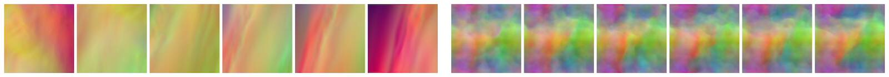

Discussion of Supervised Approaches
=======================

The previous example illustrates that we can quite easily use 
supervised training to solve complex tasks. The main workload is
collecting a large enough data set of examples. Once that exists, we can
train a network to approximate the solution manifold sampled
by these solutions, and the trained network can give us predictions
very quickly. There are a few important points to keep in mind when 
using supervised training.



## Some things to keep in mind...

### Natural starting point

_Supervised training_ is the natural starting point for **any** DL project. It always,
and we really mean **always** here, makes sense to start with a fully supervised
test using as little data as possible. This will be a pure overfitting test,
but if your network can't quickly converge and give a very good performance 
on a single example, then there's something fundamentally wrong
with your code or data. Thus, there's no reason to move on to more complex
setups that will make finding these fundamental problems more difficult.

```{admonition} Best practices 👑
:class: tip

To summarize the scattered comments of the previous sections, here's a set of "golden rules"  for setting up a DL project.

- Always start with a 1-sample overfitting test.
- Check how many trainable parameters your network has.
- Slowly increase the amount of training data (and potentially network parameters and depth).
- Adjust hyperparameters (especially the learning rate).
- Then introduce other components such as differentiable solvers or adversarial training.

```


### Stability

A nice property of the supervised training is also that it's very stable.
Things won't get any better when we include more complex physical 
models, or look at more complicated NN architectures.

Thus, again, make sure you can see a nice exponential falloff in your training 
loss when starting with the simple overfitting tests. This is a good
setup to figure out an upper bound and reasonable range for the learning rate
as the most central hyperparameter.
You'll probably need to reduce it later on, but you should at least get a 
rough estimate of suitable values for $\eta$.

### Know your data

All data-driven methods obey the _garbage-in-garbage-out_ principle. Because of this it's important
to work on getting to know the data you are dealing with. While there's no one-size-fits-all
approach for how to best achieve this, we can strongly recommend to track
a broad range of statistics of your data set. A good starting point are
per quantity mean, standard deviation, min and max values. 
If some of these contain unusual values, this is a first indicator of bad 
samples in the data set.

These values can 
also be easily visualized in terms of histograms, to track down
unwanted outliers. A small number of such outliers 
can easily skew a data set in undesirable ways.

Finally, checking the relationships between different quantities 
is often a good idea to get some intuition for what's contained in the
data set. The next figure gives an example for this step.

```{figure} resources/supervised-example-plot.jpg
---
height: 300px
name: supervised-example-plot
---
An example from the airfoil case of the previous section: a visualization of a training data 
set in terms of mean u and v velocity of 2D flow fields. It nicely shows that there are no extreme outliers,
but there are a few entries with relatively low mean u velocity on the left side. 
A second, smaller data set is shown on top in red, showing that its samples cover the range of mean motions quite well.
```

### Where's the magic? 🦄 

A comment that you'll often hear when talking about DL approaches, and especially
when using relatively simple training methodologies is: "Isn't it just interpolating the data?"

Well, **yes** it is! And that's exactly what the NN should do. In a way - there isn't 
anything else to do. This is what _all_ DL approaches are about. They give us smooth
representations of the data seen at training time. Even if we'll use fancy physical 
models at training time later on, the NNs just adjust their weights to represent the signals
they receive, and reproduce it.

Due to the hype and numerous success stories, people not familiar with DL often have 
the impression that DL works like a human mind, and is able to extract fundamental
and general principles from data sets (["messages from god"](https://dilbert.com/strip/2000-01-03) anyone?).
That's not what happens with the current state of the art. Nonetheless, it's
the most powerful tool we have to approximate complex, non-linear functions.
It is a great tool, but it's important to keep in mind, that once we set up the training
correctly, all we'll get out of it is an approximation of the function the NN
was trained for - no magic involved.

An implication of this is that you shouldn't expect the network 
to work on data it has never seen. In a way, the NNs are so good exactly 
because they can accurately adapt to the signals they receive at training time,
but in contrast to other learned representations, they're actually not very good
at extrapolation. So we can't expect an NN to magically work with new inputs.
Rather, we need to make sure that we can properly shape the input space,
e.g., by normalization and by focusing on invariants. 

To give a more specific example: if you always train
your networks for inputs in the range $[0\dots1]$, don't expect it to work
with inputs of $[27\dots39]$. In certain cases it's valid to normalize
inputs and outputs by subtracting the mean, and normalize via the standard 
deviation or a suitable quantile (make sure this doesn't destroy important
correlations in your data).

As a rule of thumb: make sure you actually train the NN on the 
inputs that are as similar as possible to those you want to use at inference time.

This is important to keep in mind during the next chapters: e.g., if we
want an NN to work in conjunction with a certain simulation environment,
it's important to actually include the simulator in the training process. Otherwise,
the network might specialize on pre-computed data that differs from what is produced
when combining the NN with the solver, i.e it will suffer from _distribution shift_.

### Meshes and grids

The previous airfoil example used Cartesian grids with standard 
convolutions. These typically give the most _bang-for-the-buck_, in terms
of performance and stability. Nonetheless, the whole discussion here of course 
also holds for other types of convolutions, e.g., a less regular mesh
in conjunction with graph-convolutions, or particle-based data
with continuous convolutions (cf {doc}`others-lagrangian`). You will typically see reduced learning
performance in exchange for improved sampling flexibility when switching to these.

Finally, a word on fully-connected layers or _MLPs_ in general: we'd recommend
to avoid these as much as possible. For any structured data, like spatial functions,
or _field data_ in general, convolutions are preferable, and less likely to overfit.
E.g., you'll notice that CNNs typically don't need dropout, as they're nicely
regularized by construction. For MLPs, you typically need quite a bit to
avoid overfitting.


## Supervised training in a nutshell

To summarize, supervised training has the following properties.

✅ Pros: 
- Very fast training.
- Stable and simple.
- Great starting point.

❌ Con: 
- Lots of data needed.
- Sub-optimal performance, accuracy and generalization.
- Interactions with external "processes" (such as embedding into a solver) are difficult.

The next chapters will explain how to alleviate these shortcomings of supervised training.
First, we'll look at bringing model equations into the picture via soft constraints, and afterwards
we'll revisit the challenges of bringing together numerical simulations and learned approaches.


